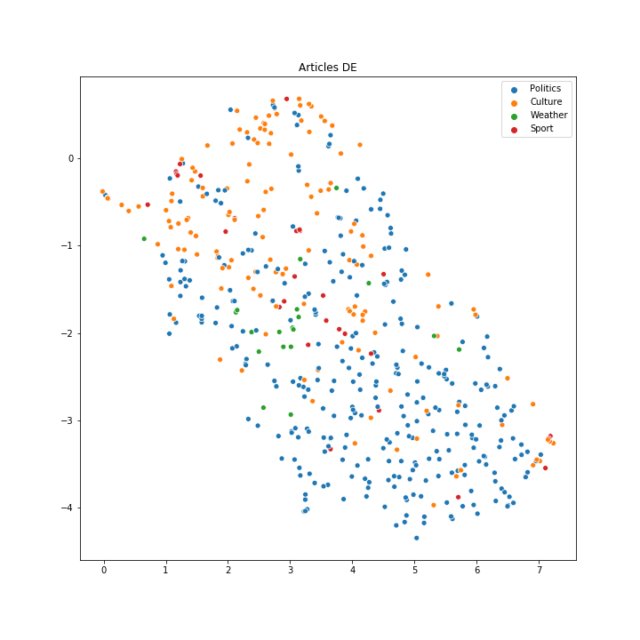
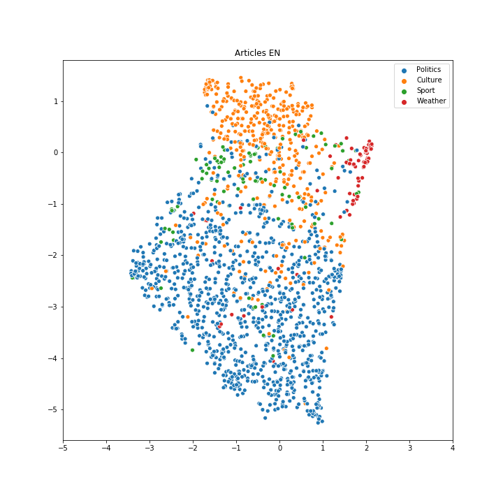
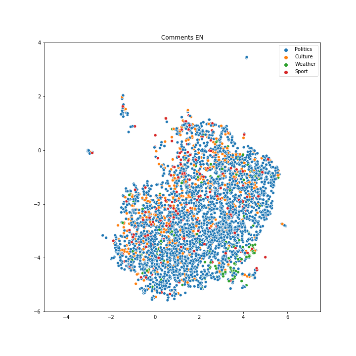

```{r setup, include=FALSE}
knitr::opts_chunk$set(echo = FALSE,
                      warning = FALSE,
                      message = FALSE,
                      cache = TRUE)
```


```{r}
library(knitr)
library(tidyverse)
library(lubridate)
library(stringr)
library(jsonlite)
library(ggbeeswarm)
library(ggridges)
library(quanteda)

unzip(zipfile = "../articles.zip")
articles <- read_json("articles.json")
languages <- c("German", "Spanish", "French", "Italian", "Japanese",
               "Portuguese", "Chinese", "English", "Russian", "Arabic")

## aggregating article features
articles_summaries <- articles %>% 
  map(.f = function(article) {
    
    comments <- map(.x = languages, .f = function(lang) {
      nr_comments <- length(article$content[[lang]]$comments)
      article_exists <- !is.null(article$content[[lang]])
      data.frame(language = lang, nr_comments = nr_comments,
                 article_exists = article_exists)
    }) %>% 
      bind_rows()
    
    data.frame(title = article$TITLE,
               link = article$link,
               published = article$PUBLISHED,
               created = article$CREATED,
               subject = article$SUBJECT,
               authortag = article$AUTHORSTAG,
               author = article$AUTHORS,
               # we assume first mentioned category is most important category
               category = article$category[[1]][[1]]) %>% 
      cbind(., comments)
  }) %>% 
  bind_rows() %>% 
  as_tibble() %>% 
  mutate(published = parse_date_time(published, orders = "%d.%m.%Y %H:%M", tz = "CET"),
         created = parse_date_time(created, orders = "%d.%m.%Y %H:%M", tz = "CET"))
```

## English comments on swissinfo.ch
```{r fig.height = 5.5}
## wordcloud plot
# wordcloud_languages <- c("German", "English")
wordcloud_languages <- c("English")
for (lang in wordcloud_languages) {
  map(articles, function(article) {
    article$content[[lang]]$comments
  }) %>% 
  unlist() %>% 
  corpus() %>% 
  dfm(remove = c(stopwords(ifelse(lang == "English", "en", "de")), "dass"),
      remove_punct = TRUE, remove_numbers = TRUE) %>% 
  textplot_wordcloud(min_count = 6, random_order = FALSE,
                     rotation = 0.25, max_size = 8,
                     color = RColorBrewer::brewer.pal(4, "Dark2"))  
}
```


## Goals

### Compare <font class="red2">comments on swissinfo.ch</font> based on
* language
* topic of article
* publication date
* author

> ### To <font class="red2">answer</font>
- Any language communities comment more on specific topics?
- Are there time-trends?
- Any language communities comment more / less positive?
- Who is the most hated / loved author?

## What did we do?

### Scraped swissinfo.ch to build <font class="red2"> huge data set  </font>
&rarr; articles and comments in different languages  
&rarr; available on GitHub (work-in-progress!)

### Exploratory <font class="red2"> data analysis </font>
&rarr; identified some general trends


## Data analysis - Language comparison 

```{r}
## computing some summary statistics
library(kableExtra)
articles_summaries %>% 
  group_by(language) %>% 
  summarise(`Articles` = sum(article_exists),
            `Total comments` = sum(nr_comments),
            `Avg number of comments` = round(`Total comments`/`Articles`, 1)) %>% 
  rename(Language = language) %>% 
  arrange(-`Avg number of comments`) %>% 
  kable() %>% 
  kable_styling(bootstrap_options = "striped", font_size = 35,
                stripe_color = "red2")
```

## Data analysis -- Outliers
```{r}
articles_summaries %>% 
  filter(nr_comments >= 45) %>% 
  rename(Comments = nr_comments,
         Title = title,
         Language = language) %>% 
  select(Title, Language, Comments) %>% 
  arrange(-Comments) %>% 
  kable()
```

## Data analysis - Time trends

```{r fig.height = 5.5}
## time-series plot per category
articles_summaries %>% 
  mutate(category = fct_lump(f = category, n = 4)) %>%
  mutate(date = date(published)) %>% 
  group_by(date, category) %>%
  summarise(sum_comments = sum(nr_comments)) %>%
  ggplot(aes(x = date, y = sum_comments)) +
  geom_bar(stat = "identity") +
  geom_smooth(alpha = 0.5) +
  facet_wrap(~ category) +
  scale_y_sqrt(breaks = c(0, 2, 10, 25, 50, 100, 150, 200)) +
  labs(x = "Date", y = "Total number of comments")
```

## Data analysis - Article categories
```{r fig.height = 5.5}
## distribution of comments per language and category
articles_summaries %>% 
  filter(article_exists == TRUE) %>% 
  mutate(category = fct_lump(f = category, n = 5)) %>%
  ggplot(aes(x = category, y = nr_comments, color = category)) +
  geom_boxplot(alpha = 0.1) +
  # geom_quasirandom(alpha = 0.7) +
  guides(color = FALSE) + 
  facet_wrap(~ language, ncol = 3, scales = "free") +
  labs(x = "Category", y = "Number of comments") +
  coord_flip()
```


## Data analysis - Word vec embeddings

  <span> 
      </img>
  </span>
  <span> 
     </img>
  </span>

## Data analysis - Word vec embeddings

<span> 
      </img>
  </span>
  <span> 
     </img>
</span>

## Conclusions

- swissinfo.ch can easily be scraped
- Generated large multilingual data sets 
- Some general trends visible in data
<!-- - <font class="red2"> English articles </font> receive most comments -->
<!-- - <font class="red2"> Culture articles </font> receive least comments -->


## Outlook

- Finish scraping
- Sentiment analysis of comments
- Build app to explore data set interactively
- Try to better model commenting process
